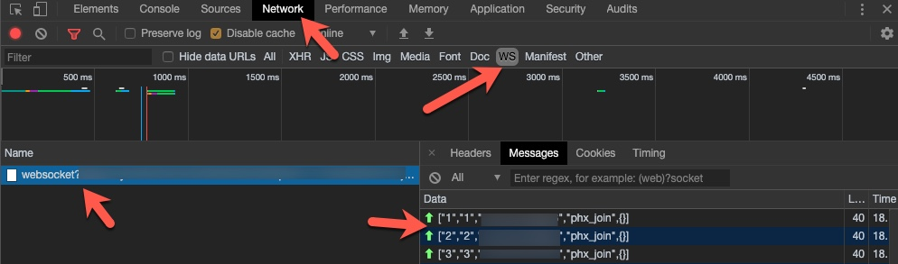

This software is provided for free to do whatever you want with, I make no guarantees about it. Updated to suit my needs from the [original author's repo](https://github.com/AMcPherran/SmartRent-MQTT-Bridge).

## How it Works:

When the container starts, Chrome is launched headlessly as a Selenium driver and navigates to the SmartRent login page, logs you in, then navigates to the home control page. Chrome is configured to proxy the connection through [mitmproxy](https://mitmproxy.org/) with the `smartrent-bridge.py` script set to manipulate the WebSocket connection. `smartrent-bridge.py` will translate MQTT publications to WebSocket messages and vice-versa.

# How to use it:

The easiest way to run this is with [Docker](https://docs.docker.com/install/):
`docker-compose up --build`, or to run in background `docker-compose up -d --build`

## Finding your Device IDs

Before this will work, you need to find out your devices' device ID and then set these values in the `smartrent-bridge.py` file.

Open Chrome and Chrome's devtools, then navigate to the [smartrent website](https://control.smartrent.com). After logging into the app, go to the [resident page](https://control.smartrent.com/resident). Inspect the Networking tab in the Chrome devtools and filter requests to only show WebSockets.



## Configure your Devices:

You will likely need to edit the `devices` variable in `smartrent-bridge.py` to make it match the devices and Device IDs in your apartment.

```python
    devices = {
    #   devId: ["friendly name", "device_mqtt_topic", "device type"]
        31411: ["Bedroom Thermostat", "bedroom_thermostat", "thermostat"],
    }
```

## Set these Environment Variables in `smartrent.env`:

| Variable           |     Example      | Purpose                                                             |
| ------------------ | :--------------: | ------------------------------------------------------------------- |
| SMARTRENT_EMAIL    | user@example.com | Used to automatically log into your SmartRent account with Selenium |
| SMARTRENT_PASSWORD | aS$ecureP4ssw0rd | ^                                                                   |
| MQTT_HOST          | mqtt.example.com | IP/Hostname of your MQTT Broker                                     |
| MQTT_PORT          |       8883       | MQTT broker defaults are 1883 and 8883 for TLS                      |
| MQTT_TLS           |       True       | Whether communication with MQTT Broker should be encrypted          |
| MQTT_USER          |    mqtt_user     | MQTT Username                                                       |
| MQTT_PASS          |   example_pass   | MQTT Password                                                       |
| MQTT_TOPIC_PREFIX  |    smartrent     | Prefix for all MQTT topics                                          |

## MQTT Topics

`<device_mqtt_topic>` is determined by the `devices` variable configuration.

#### Thermostat Topics

| MQTT Topic                                                   | Purpose                                     |    Values    |
| ------------------------------------------------------------ | :------------------------------------------ | :----------: |
| <MQTT_TOPIC_PREFIX>/<device_mqtt_topic>/target/cool/temp     | The current target temperature              |   Integer    |
| <MQTT_TOPIC_PREFIX>/<device_mqtt_topic>/target/heat/temp     | The current target temperature              |   Integer    |
| <MQTT_TOPIC_PREFIX>/<device_mqtt_topic>/target/cool/temp/set | Set the the desired target cool temperature |   Integer    |
| <MQTT_TOPIC_PREFIX>/<device_mqtt_topic>/target/heat/temp/set | Set the the desired target heat temperature |   Integer    |
| <MQTT_TOPIC_PREFIX>/<device_mqtt_topic>/current/temp         | The actual temperature                      |   Integer    |
| <MQTT_TOPIC_PREFIX>/<device_mqtt_topic>/current/humidity     | The current humidity                        |   Integer    |
| <MQTT_TOPIC_PREFIX>/<device_mqtt_topic>/mode                 | The current operation mode                  | "off","heat" |
| <MQTT_TOPIC_PREFIX>/<device_mqtt_topic>/mode/set             | Set current operation mode                  | "off","heat" |

#### Lock Topics

| MQTT Topic                                     | Purpose                                 |       Values        |
| ---------------------------------------------- | :-------------------------------------- | :-----------------: |
| <MQTT_TOPIC_PREFIX>/<device_mqtt_topic>/status | The current state of the lock           | "locked","unlocked" |
| <MQTT_TOPIC_PREFIX>/<device_mqtt_topic>/set    | Set whether the door should be lock     |       "true"        |
| <MQTT_TOPIC_PREFIX>/<device_mqtt_topic>/detail | Details about the last lock interaction |       String        |

# More on SmartRent's System

## Websocket Message Formats

A list of the important WebSocket messages exchanged between the web client and SmartRent's service can be found [here (WIP)](https://github.com/AMcPherran/SmartRent-MQTT-Bridge/blob/master/Message-Formats.md)
